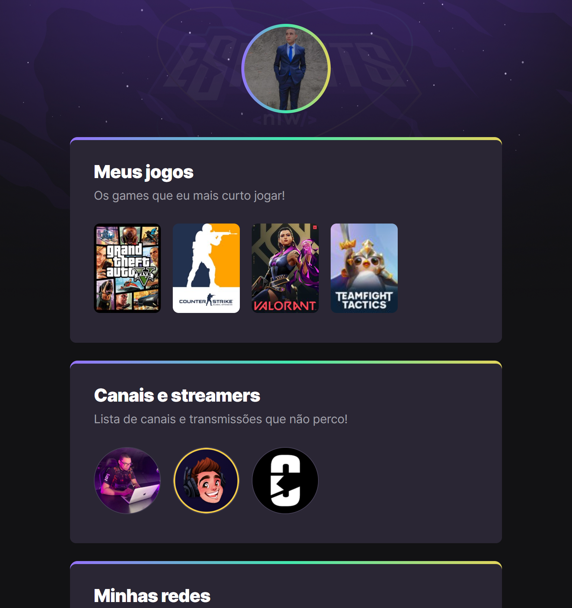

# NLW eSports

> Trilha Explorer

Projeto construído do evento Next Level Week da Rocketseat.

[🔗Clique aqui para acessar](https://pedro2869.github.io/meus-jogos/)

## 🛠️ Tecnologias

- HTML
- CSS
- Git e Github

## O que eu aprendi?

Pude observar que essas tecnologias são muito famosas no mercado de trabalho, claro, sempre atreladas a frameworks de diferentes tipos, e meu conhecimento foi ampliado através desse evento e vou continuar estudando, praticando para sempre poder chegar ao próximo nível.

## ❤️ Contato

pedrobarbosar12@gmail.com